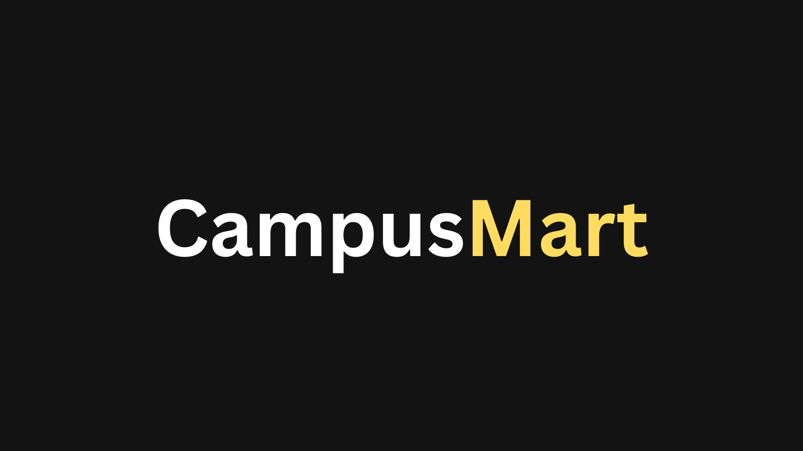

# CampusMart - Campus Marketplace

CampusMart is a second-hand marketplace application designed for campus communities. It allows students to buy and sell textbooks, furniture, electronics, clothing, and more within their campus environment.



## 📖 About

CampusMart aims to create a sustainable and affordable marketplace specifically for campus communities. By connecting students who want to sell items they no longer need with those looking for affordable alternatives to buying new, we help:

- Reduce waste and promote sustainability
- Make education more affordable through second-hand textbook sales
- Help students furnish their living spaces on a budget
- Create a trusted community marketplace specific to your campus

This project was built as a final year academic project using modern web technologies and best practices in web development.

## 🚀 Features

- **User Authentication**:

  - Google login via Supabase
  - Protected routes for authenticated users
  - Automatic profile creation after first login

- **User Profiles**:

  - Create and manage your personal profile
  - Upload profile pictures
  - Update contact information and bio

- **Listings Management**:

  - Create new listings with details and images
  - Edit your existing listings
  - Delete listings you no longer need
  - View all your active listings in the dashboard

- **Search & Filters**:

  - Search listings by keywords
  - Filter by category (Books, Electronics, Furniture, Clothing, etc.)
  - Filter by location (North Campus, South Campus, etc.)
  - Sort by price (low to high, high to low) or date posted

- **Responsive Design**:
  - Optimized for desktop, tablet, and mobile devices
  - Consistent experience across all screen sizes

## 🛠️ Tech Stack

- **Frontend**: Next.js 15, React 19, TypeScript
- **UI**: Tailwind CSS, ShadCN UI (built on Radix UI primitives)
- **Forms**: React Hook Form with Zod validation
- **Database**: Supabase (PostgreSQL)
- **Authentication**: Supabase Auth with Google OAuth
- **State Management**: React Context API
- **Styling**: CSS Variables, Tailwind CSS
- **Image Handling**: Next.js Image with remote patterns

## 📋 Prerequisites

- Node.js 18.17 or later
- npm, yarn, pnpm, or bun
- Supabase account (for database and authentication)

## 🔧 Setup

### 1. Clone the repository

```bash
git clone https://github.com/Kritikasingh2004/campusmart.git
cd campusmart
```

### 2. Install dependencies

```bash
npm install
# or
yarn install
# or
pnpm install
# or
bun install
```

### 3. Set up environment variables

Create a `.env.local` file in the root directory with the following variables:

```
NEXT_PUBLIC_SUPABASE_URL=your_supabase_url
NEXT_PUBLIC_SUPABASE_ANON_KEY=your_supabase_anon_key
```

### 4. Set up Supabase

1. Create a new project on [Supabase](https://supabase.com)
2. Set up authentication with Google provider:
   - Go to Authentication > Providers > Google
   - Enable Google auth
   - Add your Google client ID and secret
   - Set the callback URL to `http://localhost:3000/callback`
   - Make sure to add the same domain to your Google OAuth authorized redirect URIs
3. Create the database tables with the following schema:

   **Users Table**

   ```sql
   CREATE TABLE public.users (
     id UUID PRIMARY KEY REFERENCES auth.users(id),
     email TEXT,
     name TEXT,
     avatar_url TEXT,
     location TEXT,
     phone TEXT,
     bio TEXT,
     created_at TIMESTAMPTZ DEFAULT NOW(),
     updated_at TIMESTAMPTZ
   );
   ```

   **Listings Table**

   ```sql
   CREATE TABLE public.listings (
     id UUID PRIMARY KEY DEFAULT uuid_generate_v4(),
     title TEXT NOT NULL,
     description TEXT,
     price NUMERIC NOT NULL,
     image_url TEXT,
     location TEXT,
     category TEXT,
     user_id UUID REFERENCES public.users(id),
     created_at TIMESTAMPTZ DEFAULT NOW(),
     updated_at TIMESTAMPTZ
   );
   ```

4. Set up Row Level Security (RLS) policies for your tables to control access

### 5. Run the development server

```bash
npm run dev
# or
yarn dev
# or
pnpm dev
# or
bun dev
```

Open [http://localhost:3000](http://localhost:3000) with your browser to see the application.

## 📁 Project Structure

```
campusMart/
├── app/                  # Next.js app directory
│   ├── (auth)/           # Authentication routes
│   ├── api/              # API routes
│   ├── create-listing/   # Create listing page
│   ├── create-profile/   # Create profile page
│   ├── dashboard/        # User dashboard
│   ├── edit-listing/     # Edit listing page
│   ├── examples/         # Example components
│   ├── listing/          # Listing details page
│   ├── profile/          # User profile page
│   └── page.tsx          # Home page
├── components/           # React components
│   ├── auth/             # Authentication components
│   ├── layout/           # Layout components
│   ├── listings/         # Listing components
│   ├── profile/          # Profile components
│   └── ui/               # UI components (ShadCN)
├── contexts/             # React contexts
├── hooks/                # Custom React hooks
├── lib/                  # Utility libraries
│   └── validators/       # Zod validators
├── public/               # Static assets
├── types/                # TypeScript type definitions
└── utils/                # Utility functions
    └── supabase/         # Supabase client utilities
```

## 🔄 Database Schema

### Users Table

- `id` (uuid, primary key, references auth.users.id)
- `email` (text)
- `name` (text)
- `avatar_url` (text)
- `location` (text)
- `phone` (text)
- `bio` (text)
- `created_at` (timestamptz)
- `updated_at` (timestamptz)

### Listings Table

- `id` (uuid, primary key)
- `title` (text)
- `description` (text)
- `price` (numeric)
- `image_url` (text)
- `location` (text)
- `category` (text)
- `user_id` (uuid, foreign key to users.id)
- `created_at` (timestamptz)
- `updated_at` (timestamptz)

## 🧪 Development

### Form Validation

The application uses Zod for form validation. Schemas are defined in the `lib/validators` directory.

### Authentication Flow

1. User clicks "Sign in with Google" button
2. User is redirected to Google for authentication
3. After successful authentication, user is redirected to `/callback` route in the `(auth)` directory
4. The callback route exchanges the OAuth code for a session
5. The callback route checks if the user has a profile in the `users` table
6. If no profile exists, one is created automatically with basic information from Google
7. User is redirected to the dashboard or the originally requested protected route

### Protected Routes

The following routes are protected and require authentication:

- `/dashboard`
- `/create-listing`
- `/edit-listing`
- `/profile`
- `/create-profile`

## 📝 License

This project is licensed under the MIT License - see the LICENSE file for details.

## 🙏 Acknowledgements

- [Next.js](https://nextjs.org)
- [Supabase](https://supabase.com)
- [ShadCN UI](https://ui.shadcn.com)
- [Tailwind CSS](https://tailwindcss.com)
- [React Hook Form](https://react-hook-form.com)
- [Zod](https://zod.dev)
